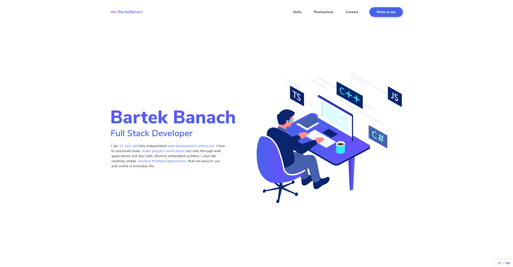

# My personal portfolio project - [bartekbanach.dev](https://bartekbanach.dev)

My personal portfolio project is a one page website built with Next.js framework. See full [desktop](design/exports/desktop/full.png) or [mobile](design/exports/mobile/full.png) design.

It consists of 3 services:

-   Portfolio.Proxy - the reverse proxy of solution
-   Portfolio.Client - the Next.js application, serves web client application
-   Portfolio.EmailGateway - the gateway service for email messages sent from contact form

# Requirements

-   Docker - to run all necessary containers on your computer
-   Visual Studio Code - I made automation scripts for tasks using this editor as runner
-   Npm & Node.js - a Javascript runtime, necessary for tooling of VSC editor

# Project structure

-   `.github` - contains github workflows configuration
-   `.vscode` - contains VSC tasks and launch configurations
-   `design` - contains all assets, design files and exported views
-   `src` - contains `docker compose` configurations and all project code and configurations
    -   `env/examples` - there are `.env` files examples for development and production environment
    -   `scripts` - production environment scripts
    -   `services` - all services implementations and configurations

# Development

## Preparing editor

To edit source of this project I recommend to use Visual Studio Code editor.

First open `portfolio.code-workspace` file using VSC and install recommended extensions. Your editor should show `Install recommended extensions` notification automatically.

## Environment variables

Before start, you have to set up necessary environment variables.

1. Copy `./src/env/examples/Portfolio.Client.env` into `./src/env/examples/Dev.Portfolio.Client.env`
2. Copy `./src/env/examples/Portfolio.EmailGateway.env` into `./src/env/examples/Dev.Portfolio.EmailGateway.env`
3. Setup environment variables in `./src/env/examples/Portfolio.EmailGateway.env` by following instructions in this file
4. Development environment is now set up!

## Startup

To start the website run `Portfolio: compose up` command in VSC. If you want to run this project without help of VSC use `docker-compose -p dev-portfolio -f dev.docker-compose.yml up --detach --remove-orphans` command.

Then wait a while and access a website under [localhost](http://localhost:80) address. It may take a long time when you are running this for the first time because of installing `npm` and `go` packages.

If you want to know what happens under the hood, you can run following commands:

-   `docker logs Dev.Portfolio.Client` - to see what happens in the client container
-   `docker logs Dev.Portfolio.EmailGateway` - to see what happens in the email gateway container
-   `docker logs Dev.Portfolio.Proxy` - to see what happens in the proxy container

Or you can just use VSC docker extension to access logs of containers.

# Services

## Overview

Services are configured using docker compose. You can find them inside `./src/services` directory. There are two versions of docker compose configuration:

-   `dev.docker-compose.yml` - development version of configuration that should be used when developing the project. This version uses environment variables from `./src/env/` directory, that should be configured before project startup.
-   `prod.docker-compose.yml` - production version of configuration. Can be only used on our production machine that you will use to deploy the website because of necessary `certbot` configuration that will not work on your local machine. This version uses environment variables from other than project source code directory, which will be described later.

The application consists of three main containers described below.

### `Portfolio.Client` - the main application

Application source: `./src/services/portfolio-client`. This directory contains client application written using `Next.js` framework.

It uses environment variables that example can be seen in `./src/env/examples/Portfolio.Client.env` file. There is only one variable: `EMAIL_GATEWAY_API_ADDRESS`. You should keep it as it is in original file and not modify. It may be used to change email gateway api address if you have customized `nginx` configuration.

The core project structure is the `Next.js` default project structure.

### `Portfolio.EmailGateway` - the email gateway service

Application source: `./src/services/email-gateway`. This project contains simple email gateway that pushes emails directly into `Google Gmail` mailbox.

It uses environment variables that example can be seen in `./src/env/examples/Portfolio.EmailGateway.env` file. There are descriptions of specific variables that you should change:

-   `ENV` - can be either `DEV` or `PROD`
-   `GMAIL_CLIENT_ID` and `GMAIL_CLIENT_SECRET` - you should get them from google api console, but you need to enable Gmail api first and then create those keys
-   `GMAIL_OAUTH2_REFRESH_TOKEN` and `GMAIL_OAUTH2_ACCESS_TOKEN` you can get yours from [oauth playground](https://developers.google.com/oauthplayground/) by following [this tutorial](https://medium.com/wesionary-team/sending-emails-with-go-golang-using-smtp-gmail-and-oauth2-185ee12ab306) and you need to authorize only this api `https://www.googleapis.com/auth/gmail.insert`.
-   `GMAIL_CONTACT_EMAIL_ADDRESS` - the email address that will be used to send emails from contact form
-   `GMAIL_OAUTH2_REDIRECT_URL` - on dev env set it to `http://localhost`, on production set it to your domain name (probably `bartekbanach.dev`)

The rest of the variables should be keep as they are.

### `Portfolio.Proxy` - the reverse proxy service for services described above

`Portfolio.Proxy` uses `nginx` as reverse proxy of the applications. It uses nginx configuration from `./src/services/proxy` for given `prod` or `dev` docker compose configuration.

In development mode, the proxy does _only_ proxy for all services making it available under one address, that fixes `CORS` issues with access to `Portfolio.EmailGateway` service when sharing the page using tools like `ngrok` or `localtunnel`.

In production environment, proxy uses `certbot` to authenticate server that is running on, does all stuff that development configuration does, and redirects from `http` to `https` protocol.

## Development configuration - `dev.docker-compose.yml`

This configuration should be used on your local machine. All containers, networks and volumes created by this configuration use `Dev.*` prefix.

It uses two `.env` files that should be located at `./src/env`:

-   `Dev.Portfolio.Client.env`
-   `Dev.Portfolio.EmailGateway.env`

See `./src/env/examples` for examples of environment variables configuration.

It shares three volumes:

-   `./src/services/portfolio-client` - the client source code directory, it is necessary because of `HMR` feature
-   `./src/services/email-gateway` - the email gateway source code directory, when using `dev` docker compose configuration it rebuilds the server every time you change the source code
-   `./src/services/proxy/dev` - the nginx reverse proxy configuration directory, if you change the proxy configuration, you need to manually restart the proxy container

## Production configuration - `prod.docker-compose.yml`

This configuration can be used only on production machine that has already connected domain, for example: it should be accessible via SSH using `bartekbanach.dev` address instead of raw IP address. All containers, networks and volumes created by this configuration use `Prod.*` prefix.

It uses three `.env` files that should be located in `/app/env` directory on our server:

-   `Prod.Portfolio.Client.env`
-   `Prod.Portfolio.EmailGateway.env`
-   `Prod.Portfolio.Proxy.env`

You have to build all images before use and after every change, it means - during every deploy. After build, it is very quick to start all applications from built containers. Also, if you have changed env variables, you should rebuild images. `Portfolio.Client` uses environment variables during image build, so you have to take look at `prod.docker-compose.yml` file and provide it manually, or use `./src/scripts/build.sh` script. The `./src/scripts/deploy.sh` script uses that `build.sh` script too, so you don't need to call `build.sh` script before every deploy.

In this configuration, `Portfolio.Proxy` uses `certbot` to automatically fetch and use SSL certificates. Do not forget to set the `CERTBOT_EMAIL` environment variable for `Portfolio.Proxy` service!

It shares three volumes

-   `./src/services/proxy/prod`
-   `./src/services/portfolio-client`
-   `Prod.Portfolio.Proxy.Certificates`

# Deployment

## Overview

This configuration uses simplified deployment process (without testing), assuming that person that does a new release has enough skills to connect to the production server in case of deployment error because there is no automatic rollback to latest working version and there is no need to have one. And, of course, this person needs to know how to fix this issue. 😅

But! There is always an option to delete newly created deployment. It will detect it and fetch older release and all should be fine.

## The process

The process is very simple. Change something in code, commit it, push it, merge to master branch.

Then go to releases page on github repository and create new release. Publish it. And check github Deploy via SSH action, there should be new one created. You should watch logs every time you are creating a new release.

You can see how does the deploy script look like here: `./src/scripts/prod/deploy.sh`.

So, deploy consists of few steps:

1. loads environment variables for deploy script from `/app/env/Prod.Portfolio.Deploy.env`
2. fetches latest release id using personal access token and repository name loaded in previous step
3. downloads repository source code of latest available release
4. unpacks latest release in temporary directory
5. builds images of latest release in temporary directory
6. then turns off old production environment
7. removes old project files in `/app/project`
8. moves latest release files from temporary directory to `/app/project`
9. removes all temporary deploy artifacts
10. starts production environment up

## Production machine configuration

There are a few requirements for production machine:

-   installed docker and docker-compose
-   installed jq package for parsing json in bash script
-   running docker service
-   unlocked ssh, http and https ports in firewall
-   deploy user, for example `www` in `docker` group with read and write access to `/app` directory
-   three directories created inside `/app`:
    -   `project` - contains actual project files
    -   `env` - contains environment variables configuration for every service and script, you should copy all files from `./src/env/examples` with `Prod.*` prefix and set all variables to expected values
    -   tmp - temporary directory for downloading, unpacking and building releases, used only during deploy, should be empty between deploys

## Personal access token

This step have to be done always, even if the repository is public. It is here in case if repository _would_ be private.

Because we can't access release info in private repository using Github's Deploy keys, we have to generate a personal access token to use with deploy script.

You will set newly created personal access token in `/app/env/Prod.Portfolio.Deploy.env` file on production machine. See `Preparation of the server` step below.

## Preparation of the server

There is available a script that helps to prepare machine quickly, but you have to paste all commands in this script to your production machine manually. Script is available here: `./src/scripts/prepare-machine.sh`.

The last one step in `./src/scripts/prepare-machine.sh` script should work without any errors, because it iss used by Deploy via SSH action.

## `Deploy via SSH` github workflow

There is `Deploy via SSH` github workflow that is called automatically on every creation of new or deletion of old release.

It uses SSH to access our production server and runs `./src/scripts/deploy.sh` script.

Repository secrets configuration is necessary to use this mechanism.

## Repository secrets

To use this mechanism, you have to set 4 repository secrets:

-   `HOST` - the host to connect to using SSH, probably just `bartekbanach.dev`
-   `PORT` - the SSH connection port to use, it is `22`, unless it is changed
-   `USERNAME` - deploy user name, if you followed the steps from `prepare-machine.sh` script, it should be `www` user name
-   `PASSWORD` - password for your deploy user

## First deploy

Now push commits to master branch and create a new release. Website on production machine should update after a short while.

# Authors

Programmer: [Bartłomiej Banach](https://github.com/thebartekbanach)

Designer: [Mateusz Krom](https://behance.net/MateuszKrom)

# License

Just use anything you want from my project, except licenses. You can feel free to inspire using design of my project, but do not copy it 1:1.
